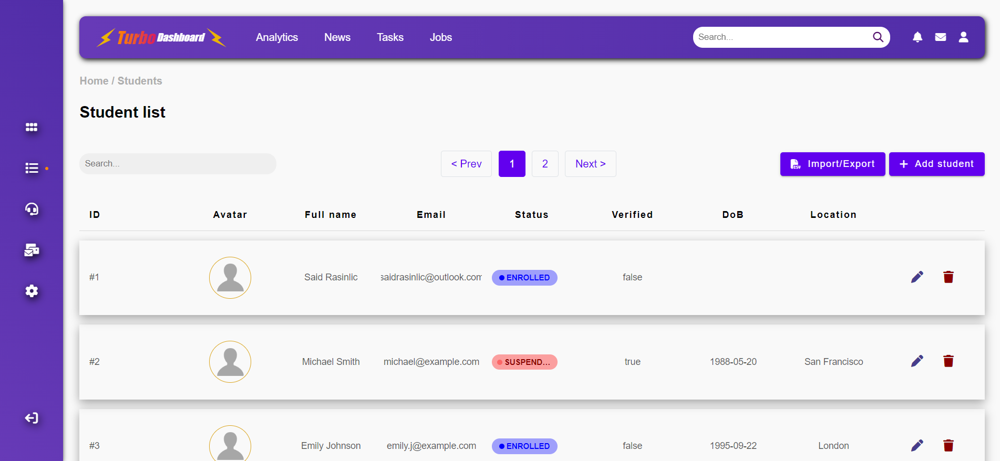
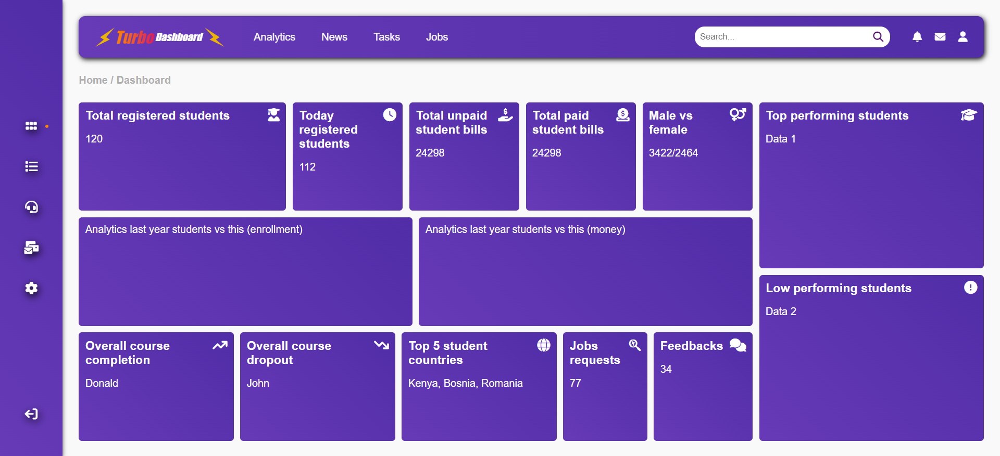
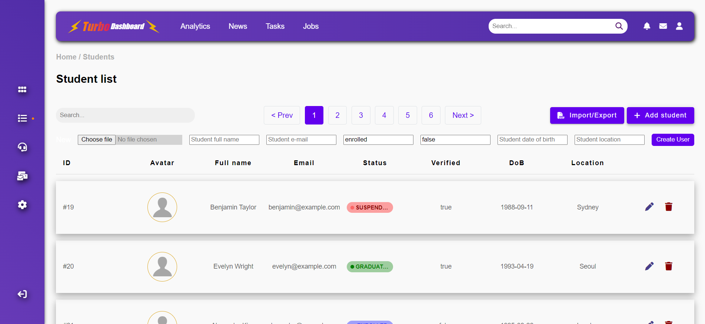
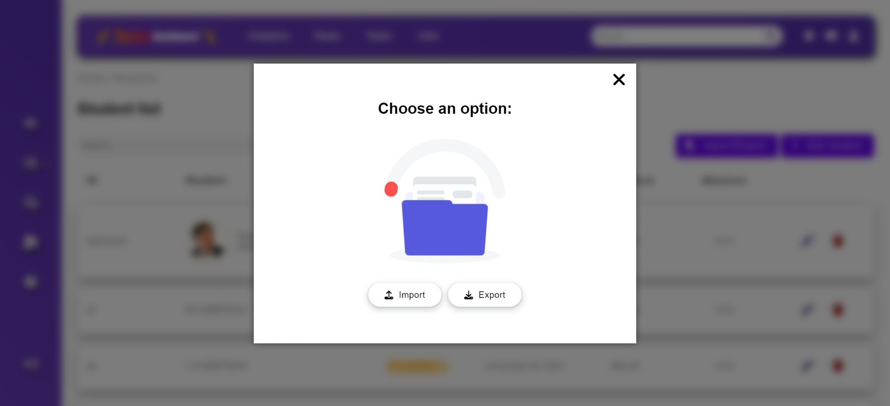

# Student Registration System

This Ruby on Rails project is aimed at building a web application for managing student registrations. The system allows educational institutions or organizations to efficiently handle the registration process for students, providing a convenient platform for both administrators and students.

> [!IMPORTANT] 
> This project can and should be upgraded, as not all functionality is implemented, but rather it is a great template for future reference created by myself by using Turbo Frame and Turbo Stream technologies. Please note that some of the data is hardcoded.

## Screenshots
<!--  -->
<p float="left">
  
  
   
  
</p>

## Built With

- Ruby on Rails
- Turbo/Hotwire
- PostgreSQL
- SCSS, CSS
- Linters

## Getting Started

To set up and run the Student Registration System locally, follow these steps:

### Prerequisites

- Laptop or Desktop
- Web Browser
- Ruby (installed and set up)
- CE (preferably Visual Studio Code)

### Installation and Setup

1. Clone the repository:
   ```bash
   git clone https://github.com/SaidRasinlic/student_registration_system
   ```
2. Navigate to the correct directory (case-sensitive)

3. Run `bundle install`

4. Setup Database Configuration 

   - 1. Edit configuration manually

      - Open `config/database.yml`.

      - Find the environment section you're configuring (`development`, `test`, `production`).

      - Replace `username` and `password` with your PostgreSQL username and password.

   - 2. Use Environment Variables with `local_env.yml`

      - Create `config/local_env.yml`.

      - Add your database username and password in `key:value` format.

      - Ensure `local_env.yml` is not added to version control.

      - Load environment variables in `config/application.rb`.

## Author

👤 **Said Rasinlic**

- LinkedIn: [@LinkedIn/SaidRasinlic](https://www.linkedin.com/in/SaidRasinlic)
- Medium: [@Medium/SaidRasinlic](https://medium.com/@SaidRasinlic)
- Twitter: [@Twitter/SaidRasinlic](https://twitter.com/SaidRasinlic)
- GitHub: [@GitHub/SaidRasinlic](https://github.com/SaidRasinlic)


## 🤝 Contributing

Contributions, issues, and feature requests are welcome!

Feel free to check the [issues page](../../issues/).

## Show your support

Give a ⭐️ if you like this project!

## Acknowledgments

- N/A

## 📝 License

This project is [MIT](LICENSE) licensed.
